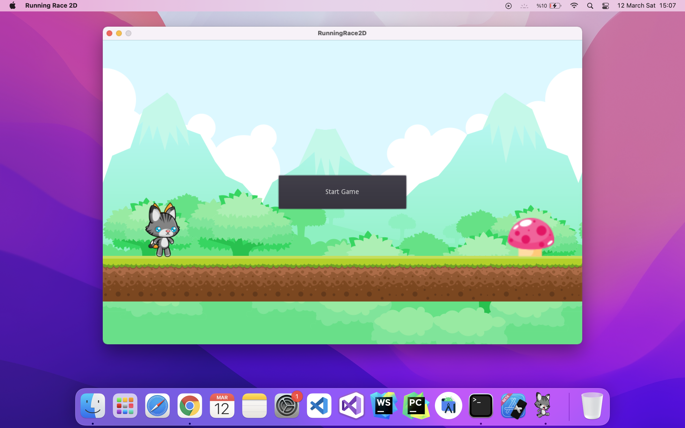
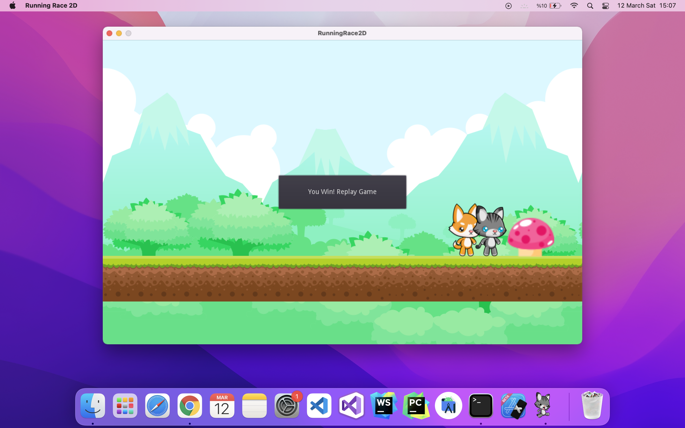

# Running Race 2D Game

* Press `left` on keyboard to put one's left foot
* Press `right` on keyboard to put one's right foot
* To run; You should press the `left` and `right` keys circularly.
* If you touch the mushroom before the computer, you win the game.
* You are `CAT(grey)` and computer is `DOG(orange)`.

